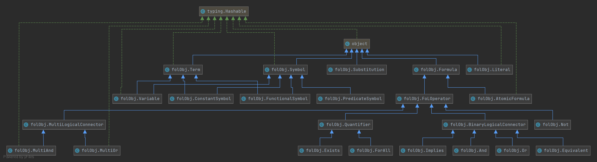

# First-order Logic Resoluter

[](https://mybinder.org/v2/gh/jerrylususu/fol/HEAD)

Language: Python

Environment Requirement: Python 3.8+

## File Structure

* `folObj.py`: All the classes for FoL, such as `Literal`, `AtomicFormula`, `PredicateSymbol`...
* `main.py`: Example of expressing FoL formula
* `norm.py`: Normalization to CNF without quantifier
* `normQ.py`: Normalization to CNF with quantifer
* `multi.py`: A special tweak to perform deduplication regarding chained AND/OR
* `mgu.py`: Find MGU
* `resolute.py`: Perform resolution

## Classes



## Run the programs

1. Open the file and go to `if __name__=="__main__"` part
2. Search for `---- INPUT AREA BEGIN -----` and `---- INPUT AREA END -----`
3. Between these two comments are the input area. Some formulas from worksheets are already here but commented. Uncomment them or write new formulas.
4. Run the file using `python3 ${filename}`


## General Steps for using FoL utilities

1. Describe the signature, by creating variables and using corresponding initializers

   ```python
   # predicate and functional symbols have to specify argument count (ar)
   P = PredicateSymbol("P", 1)
   Q = PredicateSymbol("Q", 2)
   f = FunctionalSymbol("f", 1)
   
   # constant symbol and variable can be decleared directly
   a = ConstantSymbol("a")
   x = Variable("x")
   y = Variable("y")
   ```

2. Describe the formulas using prefix notation

   ```python
   # Possible List: And, Or, Not, Implies, Equivalent
   simple_formula = P(x)
   complex_formula = Implies(Or(Not(P(x)), Q(x,y)), And(P(y), Q(y, f(x))))
   
   # for quantifiers, variable need to be specified
   formula_with_quantifier = ForAll(x, P(x))
   ```

3. Call the wrappers of different functions, in different files

   ```python
   # for convert to CNF, use `normQ.py`
   # main wrapper is to_CNF_Q
   print("Output", to_CNF_Q(complex_formula))
   
   # for find MGU, use `mgu.py`
   # main wrapper is find_mgu
   literal1 = Literal(formula1)
   literal2 = Literal(formula2)
   
   print("input literal 1:", literal1)
   print("input literal 2:", literal2)
   
   subs = []
   found, found_subs = find_mgu(literal1, literal2, substitutions=subs)
   print("find MGU:", found, found_subs)
   if found:
       print("after substitution")
       apply_substitution(literal1, found_subs)
       apply_substitution(literal2, found_subs)
       print(literal1)
       print(literal2)
   
   # for perform resolution, use `resolution.py`
   # main wrapper is resolution_wrapper
   print("Resolutes:", resolution_wrapper([f1, f2,f3,Not(query)]))
   ```


## Expressing FoL

> see `main.py`

Using prefix notation. All the logical connectors can be used. Symbols and Variables need to be declared first before using them in formulas.

## Convert to CNF

> see `normQ.py`

Following the 7 steps specified in the slides of resolution, page 11, but with a minor patch on the deduplication step to make it work for chained AND/OR formulas.

## Find MGU

> see `MGU.py`

Find MGU only works for literals. Examples from worksheet 2 are included. 

## Do Resolution

> see `resolute.py`

To perform resolution, first declare all symbols, then write the formulas, finally expressing the knowledge base as a Python list object. Then `resolution_wrapper` function can be called to perform the resolution, which will print out the resolution result, and a resolution path if the knowledge base resolutes. Examples from worksheet 2, namely Barber and Descendants are included.

## Reading the outputs

> For strings not shown here, their meaning can be retrieved by searching in `folObj.py` file.

```
{L(AF(PS('Barber', 1), [CS('$c1')]))}
Reads as: {B($c1)}
{}: This is a clause (a set of literals)
L: Literal
AF: Atomic Formula (Predicate symbol + Param List)
PS: Predicate Symbol (Name + Argument Count)
CS: Constant Symbol (Starting with a doller sign indicates the symbol is generated by the program)


{L(AF(PS('Shave', 2), [Var('x'), Var('y')])), ¬L(AF(PS('Barber', 1), [Var('x')])), L(AF(PS('Shave', 2), [Var('y'), Var('y')]))}
Reads as: {S(x,y), ¬B(x), S(y,y)}
¬: Symbol for Not (Other symbols: ∧ for AND, ∨ for OR, → for Implies, ↔ for Equivalent, ∀ for Forall, ∃ for Exists)
Var: Indicating this is a variable
```


Reference output for Q4:

```
1 {L(AF(PS('Shave', 2), [Var('x'), Var('y')])), ¬L(AF(PS('Barber', 1), [Var('x')])), L(AF(PS('Shave', 2), [Var('y'), Var('y')]))}
2 {¬L(AF(PS('Barber', 1), [Var('x')])), ¬L(AF(PS('Shave', 2), [Var('y'), Var('y')])), ¬L(AF(PS('Shave', 2), [Var('x'), Var('y')]))}
3 {L(AF(PS('Barber', 1), [CS('$c1')]))}
done (3, 1) new: 4 {L(AF(PS('Shave', 2), [CS('$c1'), Var('y')])), L(AF(PS('Shave', 2), [Var('y'), Var('y')]))}
done (3, 2) new: 5 {¬L(AF(PS('Shave', 2), [CS('$c1'), Var('y')])), ¬L(AF(PS('Shave', 2), [Var('y'), Var('y')]))}
found empty clause!
[(3, 1, 4, [ST[Var('x')/CS('$c1')]]), (3, 2, 5, [ST[Var('x')/CS('$c1')]]), (5, 4, 6, [])]

3 {L(AF(PS('Barber', 1), [CS('$c1')]))}
1 {L(AF(PS('Shave', 2), [Var('x'), Var('y')])), ¬L(AF(PS('Barber', 1), [Var('x')])), L(AF(PS('Shave', 2), [Var('y'), Var('y')]))}
θ [ST[Var('x')/CS('$c1')]]
-> 4 {L(AF(PS('Shave', 2), [CS('$c1'), Var('y')])), L(AF(PS('Shave', 2), [Var('y'), Var('y')]))}
-----------
3 {L(AF(PS('Barber', 1), [CS('$c1')]))}
2 {¬L(AF(PS('Barber', 1), [Var('x')])), ¬L(AF(PS('Shave', 2), [Var('y'), Var('y')])), ¬L(AF(PS('Shave', 2), [Var('x'), Var('y')]))}
θ [ST[Var('x')/CS('$c1')]]
-> 5 {¬L(AF(PS('Shave', 2), [CS('$c1'), Var('y')])), ¬L(AF(PS('Shave', 2), [Var('y'), Var('y')]))}
-----------
5 {¬L(AF(PS('Shave', 2), [CS('$c1'), Var('y')])), ¬L(AF(PS('Shave', 2), [Var('y'), Var('y')]))}
4 {L(AF(PS('Shave', 2), [CS('$c1'), Var('y')])), L(AF(PS('Shave', 2), [Var('y'), Var('y')]))}
θ []
-> 6 set()
-----------
Resolutes: True

```


